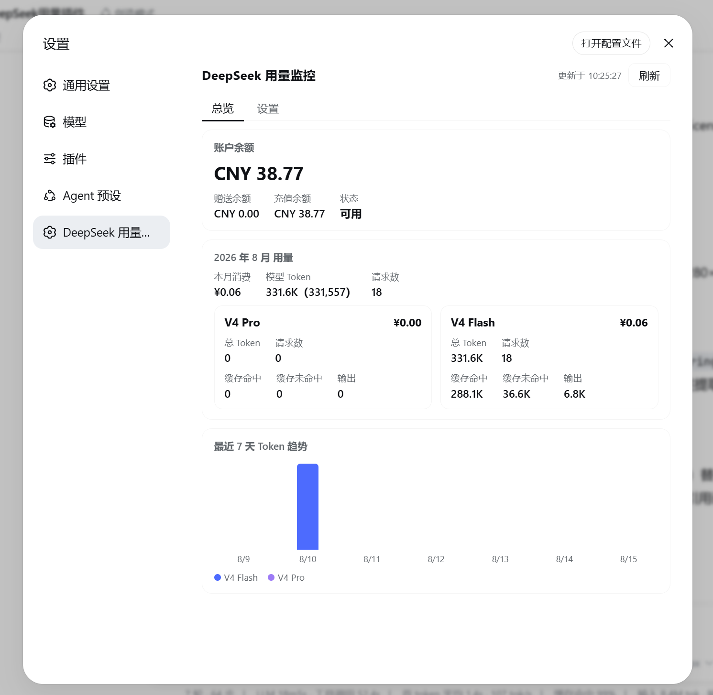
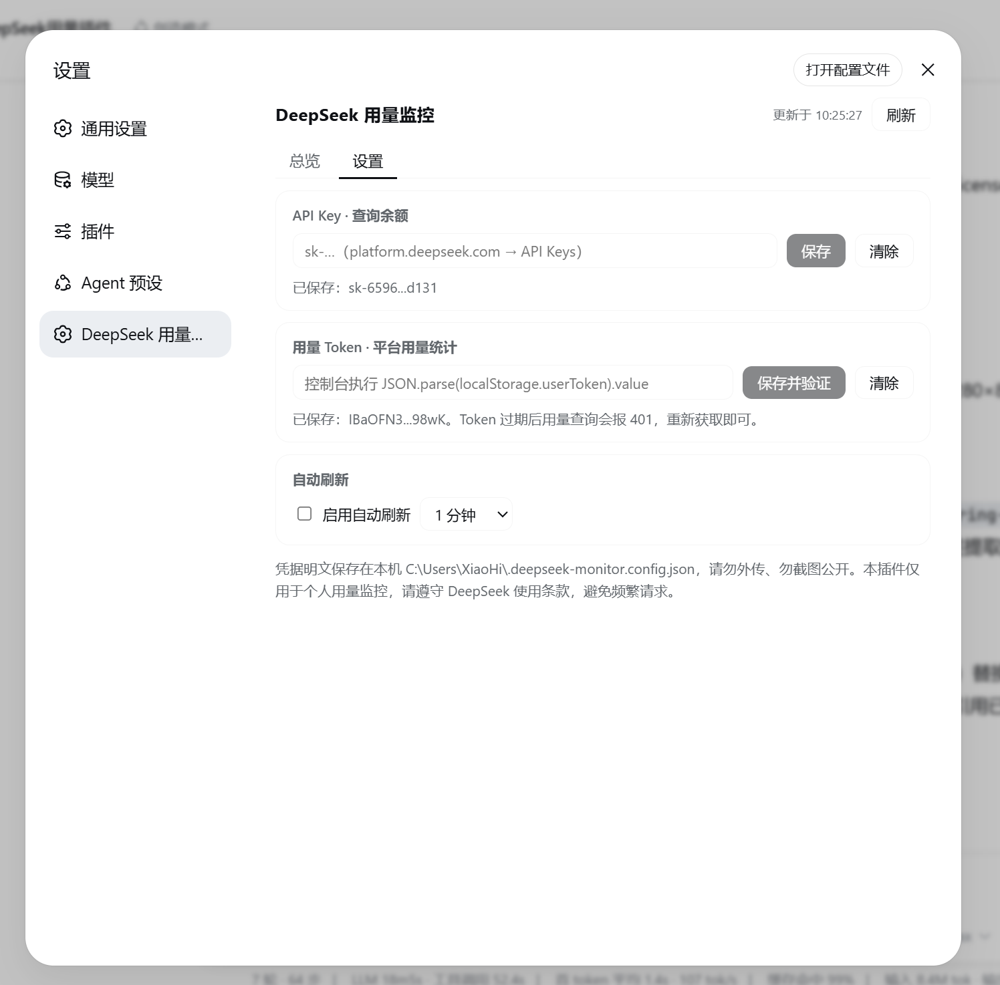

# DeepSeek Usage Monitor（简体中文）

一个运行在 **DeepSeek Harness (DSH)** 里的动态 Cordis 插件：在侧边栏设置面板中查看 DeepSeek API **账户余额、本月消费、模型 Token 用量与最近 7 天趋势**，无需额外安装应用、无需编译。

[](LICENSE)
[](README.en.md)

本项目功能参考 [JayHome137/DeepSeekMonitorWindows](https://github.com/JayHome137/DeepSeekMonitorWindows)（MIT License）实现，感谢原作者的开源工作。本项目不是 DeepSeek 官方产品。

## 功能

- 查询 DeepSeek API 账户余额（官方余额接口 `api.deepseek.com/user/balance`，需要 API Key）
- 查询平台用量数据（网页登录 Token）：本月消费、V4 Flash / V4 Pro 模型 Token 总量、请求数、缓存命中、缓存未命中、输出 Token
- 最近 7 天 Token 趋势堆叠柱状图（自动跨月合并数据）
- 自动刷新（1 / 5 / 30 / 60 分钟可调）
- 凭据保存 / 清除；用量 Token 保存时自动调平台接口验证有效性
- 双入口：设置面板固定页 + 对话流中的 `cordis_run` 卡片面板
- UI 全部使用 DSH 主题变量（`--dsw-alias-*`），自动适配明暗主题

## 截图

| 总览 | 设置 |
| :---: | :---: |
|  |  |

## 安装

本插件以 DSH **动态 Cordis 插件**（Dynamic Cordis Plugin）形态运行，无需编译。

### 方式一：复制提示词一键安装（推荐）

在 DSH 会话中直接粘贴下面这段提示词，DSH 代理会读取本仓库源码并自动完成定义与激活：

````text
请帮我安装 DeepSeek 用量监控插件（DSH 动态 Cordis 插件）：
1. 获取源码：git clone https://github.com/xiaohai-ouyang/deepseek-usage-monitor（或直接读取仓库中的 plugin-host.js 与 plugin-client.js）
2. 调用 cordis_define：
   - plugin.kind = "new"，idPrefix = "dsmon"，name = "DeepSeek 用量监控"
   - code.host：粘贴 plugin-host.js 中从 return { 开始的整个函数体
   - code.client：粘贴 plugin-client.js 中从 return { 开始的整个函数体
3. 调用 cordis_run 激活返回的 pluginId / packageId（首次运行 Client 代码需在页面审批卡上允许）
4. 激活成功后提醒用户：打开 设置 → 「DeepSeek 用量监控」，配置 API Key（platform.deepseek.com → API Keys，形如 sk-...）与用量 Token（登录 platform.deepseek.com 后在浏览器控制台执行 JSON.parse(localStorage.userToken).value 获取）
````

### 方式二：手动粘贴函数体

1. 打开 DSH 会话，调用 `cordis_define` 工具：
   - `plugin.kind`：`new`，`idPrefix` 可填 `dsmon`
   - `code.host`：粘贴 [`plugin-host.js`](./plugin-host.js) 中 `return {` 起的整个函数体
   - `code.client`：粘贴 [`plugin-client.js`](./plugin-client.js) 中 `return {` 起的整个函数体
2. 调用 `cordis_run` 激活返回的 `pluginId` / `packageId`（Client 代码首次运行需要你在页面上授权）
3. 打开侧边栏 **设置 → 「DeepSeek 用量监控」**，即可看到面板

更新与回滚：向同一 `pluginId` 追加新 Package 后 `cordis_run` 用 `update` 模式切换版本；用 `run` 模式 + 旧 `packageId` 回滚。

## 配置凭据

在面板的「设置」页签填写两项凭据：

- **API Key**（查询余额）：来自 [platform.deepseek.com](https://platform.deepseek.com) → API Keys 页面，形如 `sk-...`。保存后自动验证并拉取余额。
- **用量 Token**（查询用量）：DeepSeek 官方未提供用量 API，需要网页登录 Token。在已登录 `platform.deepseek.com` 的浏览器控制台执行：

  ```js
  JSON.parse(localStorage.userToken).value
  ```

  将结果粘贴保存，插件会自动调平台接口验证。**Token 可能过期**，用量查询报 401 时重新获取即可。

## 数据存储与安全

凭据以明文保存在当前 DSH 工作区根目录的 `.deepseek-monitor.config.json`：

```text
<工作区>/.deepseek-monitor.config.json
```

**请勿外传、勿截图公开该文件内容。** API Key 与用量 Token 属于敏感凭据，使用者需自行承担本机存储、账号安全与网络请求带来的风险。请求期间 Token 会作为 curl 的请求头参数短暂出现在本机进程列表中，请勿在不可信共享机器上使用。

## 工作原理

- Host 半（Node 进程内）通过 `subprocess` 服务调用系统自带 `curl.exe` 完成带 Bearer 认证的请求（DSH 的 `web.fetch` 接口不支持自定义请求头）
- 用量接口与参考项目一致：
  - `https://platform.deepseek.com/api/v0/usage/amount?month=<M>&year=<Y>`
  - `https://platform.deepseek.com/api/v0/usage/cost?month=<M>&year=<Y>`
- Client 半通过 `harness.handle` / `host.call` 与 Host 通信，UI 注册在 `settings.section` 与 `tool.view.cordis` 两个槽位；自动刷新使用 `timer` 服务，随插件生命周期自动清理

## 文件结构

```text
deepseek-usage-monitor/
├── plugin-host.js     # cordis_define 的 code.host（余额/用量抓取、凭据持久化、RPC）
├── plugin-client.js   # cordis_define 的 code.client（面板 UI、自动刷新）
├── screenshots/       # README 截图
├── README.md          # 本文件（默认中文说明）
├── README.en.md       # English version
├── LICENSE            # MIT
└── package.json
```

## 免责声明

本项目仅用于学习和个人用量监控。请遵守 DeepSeek 的使用条款，合理使用相关接口，避免频繁请求。DeepSeek 平台页面结构、登录状态与内部用量接口都可能变化，本项目不保证长期可用。

## License

[MIT](./LICENSE)
